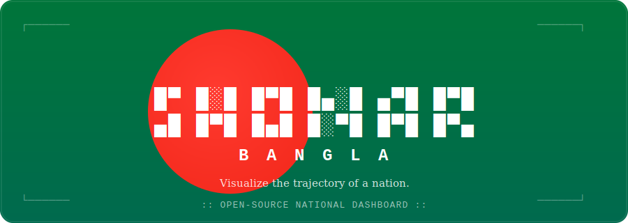

<div align="center">



*A high-performance, open-source dashboard that maps Bangladesh's socioeconomic growth and infrastructure milestones through an interactive, data-driven interface.*

<br/>

[](#)
[](#)
[](LICENSE)
[](CONTRIBUTING.md)
[](#)
[](#)
[](#)

<br/>

[**Live Demo**](#) · [**Report Bug**](../../issues) · [**Request Feature**](../../issues) · [**Docs**](#)

</div>

<br/>

---

## 📸 Overview

<div align="center">

> _Drop a 10–15s GIF here of the map interaction — this is the single highest-impact addition to this README._
> _Record with [LICEcap](https://www.cockos.com/licecap/) or [Peek](https://github.com/phw/peek), then embed it below:_

```md

```

</div>

---

## 🚀 Key Features

| | |
|---|---|
| 🗺️ **Geospatial Insights** | Real-time map views of developmental progress across all 64 districts. |
| 📊 **Data-Driven** | Centralized tracking of key national performance indicators (KPIs). |
| ⚡ **Modern Stack** | Built for scalability using a T3-inspired, MERN-style architecture. |
| 🌐 **Open Access** | Transparent, community-driven data for researchers and policymakers. |

---

## 🛠 Tech Stack


### Frontend Stack (Next.js)
| Category             | Technology                                |
| -------------------- | ----------------------------------------- |
| Framework            | Next.js 16 (App Router)                   |
| Language             | TypeScript                                |
| Runtime              | React 19                                  |
| Styling              | Tailwind CSS v4                           |
| UI Components        | shadcn/ui                                 |
| Component Library    | Radix UI                                  |
| Icons                | Lucide React                              |
| Forms                | React Hook Form                           |
| Validation           | Zod                                       |
| State Management     | Zustand                                   |
| Server State         | TanStack Query                            |
| Authentication       | Better Auth / Auth.js (or JWT via NestJS) |
| Data Fetching        | TanStack Query + Server Components        |
| Tables               | TanStack Table                            |
| Charts               | Tremor / Recharts                         |
| Rich Text            | Tiptap                                    |
| File Upload          | UploadThing / S3 Direct Upload            |
| Drag & Drop          | dnd-kit                                   |
| Command Palette      | cmdk                                      |
| Theme                | next-themes                               |
| Date                 | date-fns                                  |
| Notifications        | Sonner                                    |
| Internationalization | next-intl                                 |
| PDF Viewer           | React PDF                                 |
| Maps                 | MapLibre GL                               |
| Markdown             | react-markdown                            |
| Virtualization       | TanStack Virtual                          |
| Animation            | Motion (formerly Framer Motion)           |

### Backend Stack (Nest.js)
| Category        | Technology                     |
| --------------- | ------------------------------ |
| Framework       | NestJS                         |
| Language        | TypeScript                     |
| Runtime         | Node.js LTS                    |
| ORM             | Prisma ORM                     |
| Database        | PostgreSQL                     |
| Cache           | Redis                          |
| Search          | Elasticsearch / OpenSearch     |
| Message Queue   | RabbitMQ                       |
| Event Streaming | Apache Kafka                   |
| File Storage    | Azure Blob Storage / Amazon S3 |
| Authentication  | JWT + Refresh Tokens           |
| Authorization   | CASL / Permit.io / Custom ABAC |
| Validation      | class-validator                |
| Serialization   | class-transformer              |
| OpenAPI         | Swagger                        |
| GraphQL         | Apollo (optional)              |
| Background Jobs | BullMQ                         |
| Scheduler       | @nestjs/schedule               |
| Email           | Nodemailer                     |
| Template Engine | Handlebars                     |
| PDF Generation  | Puppeteer                      |
| Logging         | Pino                           |
| Metrics         | Prometheus                     |
| Tracing         | OpenTelemetry                  |
| Feature Flags   | OpenFeature                    |

### Database Layer
| Category         | Technology |
| ---------------- | ---------- |
| Primary Database | PostgreSQL |
| Cache            | Redis      |
| Search           | OpenSearch |
| Object Storage   | S3         |
| Vector DB        | pgvector   |
| Data Warehouse   | ClickHouse |

### Authentication & Security
  - JWT Access Token
  - Refresh Token Rotation
  - HTTP-only Cookies
  - CSRF Protection
  - OAuth2
  - OpenID Connect
  - Multi-factor Authentication (MFA)
  - RBAC
  -- ABAC
  - Multi-tenancy
  - Session Management
  - API Keys
  - Rate Limiting
  - Helmet
  - CORS
  - CSP
  - Secret Management
  - Audit Loggin
### API
  - REST API
  - OpenAPI
  - Swagger
  - API Versioning
  - Cursor Pagination
  - Idempotency
  - Problem Details (RFC 9457)
  - HATEOAS (optional)

### Devops
| Category       | Technology                        |
| -------------- | --------------------------------- |
| Container      | Docker                            |
| Orchestration  | Kubernetes                        |
| Reverse Proxy  | NGINX                             |
| IaC            | Terraform                         |
| CI/CD          | GitHub Actions / Azure DevOps     |
| Secrets        | Azure Key Vault / HashiCorp Vault |
| Monitoring     | Grafana                           |
| Metrics        | Prometheus                        |
| Logging        | Loki                              |
| Tracing        | Jaeger                            |
| Error Tracking | Sentry                            |

### Testing
| Category            | Technology            |
| ------------------- | --------------------- |
| Unit Testing        | Jest                  |
| Integration Testing | Supertest             |
| Frontend Testing    | React Testing Library |
| E2E                 | Playwright            |
| API Testing         | Bruno / Postman       |
| Contract Testing    | Pact                  |
| Load Testing        | k6                    |

### Code Quality
- ESLint
- Prettier
- Husky
- lint-staged
- Commitlint
- Conventional Commits
- Semantic Release
- Dependency Cruiser
- Madge
- SonarQube
### Documentation
- Swagger/OpenAPI
- Storybook
- Mermaid
- ADR (Architecture Decision Records)
- Compodoc
- Typedoc
- Package Management
- npm
- Turborepo (Monorepo)
- Changesets

### Cloud

- Microsoft Azure
- AWS

###  Project Structure
```text
workspace/
│
├── apps/
│   ├── web/                 # Next.js
│   ├── api/                 # NestJS API Gateway
│   ├── auth-service/
│   ├── user-service/
│   ├── organization-service/
│   ├── tenant-service/
│   ├── notification-service/
│   ├── billing-service/
│   └── worker/
│
├── packages/
│   ├── ui/
│   ├── types/
│   ├── config/
│   ├── eslint-config/
│   ├── tsconfig/
│   ├── auth-sdk/
│   ├── api-client/
│   ├── logger/
│   ├── database/
│   ├── common/
│   └── validation/
│
├── infrastructure/
│   ├── docker/
│   ├── kubernetes/
│   ├── terraform/
│   └── nginx/
│
├── docs/
├── scripts/
└── .github/
```

---

## 📦 Architecture

```
.
                   Internet
                       │
               Load Balancer
                       │
                 NGINX/Ingress
                       │
        ┌──────────────┴──────────────┐
        │                             │
   Next.js Frontend             NestJS API Gateway
                                        │
      ┌─────────────────────────────────┼─────────────────────────────┐
      │                                 │                             │
 Authentication                   User Service              Organization Service
      │                                 │                             │
      ├─────────────────────────────────┼─────────────────────────────┤
      │                                 │                             │
 Tenant Service                 Billing Service           Notification Service
      │                                 │                             │
      └─────────────────────────────────┼─────────────────────────────┘
                                        │
                        RabbitMQ / Kafka Event Bus
                                        │
        ┌──────────────────────────────────────────────────────────────┐
        │ PostgreSQL │ Redis │ OpenSearch │ S3 │ pgvector │ ClickHouse │
        └──────────────────────────────────────────────────────────────┘
```

---

## 🚀 Quick Start

**1. Clone the repo**

```bash
git clone https://github.com/yourusername/shonar-bangla.git
cd shonar-bangla
```

**2. Install dependencies**

```bash
npm install
```

**3. Configure environment**

Rename `.env.example` to `.env` and provide your `DATABASE_URL`.

```bash
cp .env.example .env
```

**4. Launch**

```bash
npm run dev
```

The app should now be running at `http://localhost:3000` 🎉

---

## 🗺️ Roadmap

- [x] Interactive district-level map
- [x] Core KPI dashboard
- [ ] Historical trend comparisons (time-series slider)
- [ ] Public API for researchers
- [ ] Mobile-first companion view

---

## 🤝 Contribution

Contributions are what make the open-source community such an amazing place to learn, inspire, and create. Any contributions you make are **greatly appreciated**.

1. Fork the project
2. Create your feature branch (`git checkout -b feature/AmazingFeature`)
3. Commit your changes (`git commit -m 'Add some AmazingFeature'`)
4. Push to the branch (`git push origin feature/AmazingFeature`)
5. Open a Pull Request

Please read [`CONTRIBUTING.md`](CONTRIBUTING.md) to get started.

---

## 📄 License

Distributed under the **MIT License**. See [`LICENSE`](LICENSE) for more information.

---

<div align="center">

Made with ❤️ for 🇧🇩

<sub>If this project helped you, consider giving it a ⭐</sub>

</div>
